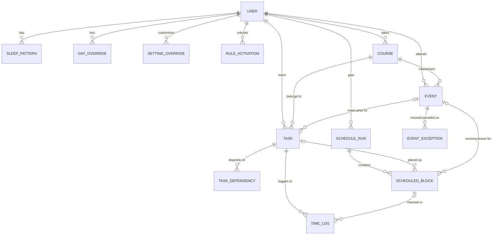

# Data Model (v1 draft)

What the app stores, for Phase 0. Built from [constraints-v1.md](constraints-v1.md) and [customization.md](customization.md). The diagram renders on GitHub.

Two design choices drive the shape:
- **Defaults live in code, not in the database.** The `setting_overrides` table stores only what the user changed. That keeps sign-up to three questions, makes "Reset to defaults" a delete, and gives the "changed from default" markers for free.
- **Schedules are versioned.** Each re-plan writes a new `schedule_run`, so the app can show what moved, explain why, and undo.

## Diagram

## Tables

### users
| Field | Type | Notes |
|---|---|---|
| id | uuid | |
| email, display_name | text | From Supabase Auth |
| timezone | text | e.g. `America/New_York`. All times stored in UTC, shown in this zone |
| created_at | timestamp | |

### sleep_patterns
Weekly wake and bed times, asked at sign-up.
| Field | Type | Notes |
|---|---|---|
| user_id | uuid | |
| weekday | 0–6 | Monday = 0 |
| wake_time, bed_time | local time | Bed time may be after midnight (e.g. 00:30) |

"Same every day" writes the same values to all seven rows; the UI remembers the choice in `setting_overrides` (`sleep.same_every_day`).

### day_overrides
One-day changes to wake or bed time ("bed at 1am this Friday").
| Field | Type | Notes |
|---|---|---|
| user_id, date | | One row per changed date |
| wake_time, bed_time | local time, nullable | Null means "use the weekly pattern" |

### setting_overrides
Only the settings the user changed. Everything else comes from the defaults file in code.
| Field | Type | Notes |
|---|---|---|
| user_id | uuid | |
| key | text | e.g. `study.max_hours_per_day`, `weights.urgency`, `recovery.after_game_minutes` |
| value | json | Number, time, boolean or small object |
| updated_at | timestamp | |

The active preset (Balanced, Deadline crunch, …) and season mode are also stored here as keys.

### rule_activations
Tracks event-triggered rules (first game, first exam, …).
| Field | Type | Notes |
|---|---|---|
| user_id, rule_key | | e.g. `game_rules`, `travel_rules`, `exam_prep`, `hard_practice_recovery`, `work_shift_rules` |
| activated_at | timestamp | When the first matching event was added |
| notice_shown | boolean | So the "we added 2 hours of recovery" note shows once |

### courses
| Field | Type | Notes |
|---|---|---|
| id, user_id | | |
| name, code | text | "Calculus I", "MATH 151" |
| standing | 0–1, nullable | How the student is doing (R6). Null = not set |
| color | text | For the calendar |

### events
Everything fixed on the calendar: classes, practices, games, lifts, work shifts, social plans, travel, exams.
| Field | Type | Notes |
|---|---|---|
| id, user_id | | |
| type | enum | `class`, `practice`, `game`, `team_other`, `travel`, `work`, `social`, `exam`, `other` |
| title | text | |
| course_id | uuid, nullable | For classes and exams |
| start_time, end_time | local time | Time of day |
| start_date, end_date | date | For one-off events these are the same day |
| repeat_weekdays | int[], nullable | e.g. `[0,2,4]` for MWF. Null = one-off |
| location | text, nullable | Used to add travel time between different places |
| intensity | enum | `light`, `normal`, `hard`. Hard practices get recovery |
| is_away | boolean | Games only |
| study_during | enum | `none`, `light`, `normal`. Travel defaults to `light` |
| flexible | boolean | Social plans: can the scheduler move it? Default false |
| arrive_early_minutes | int, nullable | Overrides the 2-hour game default for this event |

### event_exceptions
When a coach moves practice or a class is cancelled, without editing the whole series.
| Field | Type | Notes |
|---|---|---|
| event_id, date | | |
| cancelled | boolean | |
| new_start_time, new_end_time | local time, nullable | |

### tasks
| Field | Type | Notes |
|---|---|---|
| id, user_id | | |
| course_id | uuid, nullable | |
| title | text | |
| type | enum | `assignment`, `reading`, `project`, `lab`, `exam_prep`, `other` |
| estimated_hours | decimal | What the student typed, before padding |
| percent_complete | 0–100 | Remaining = estimated × padding × (1 − percent) |
| deadline | timestamp | Hard (H19) |
| release_at | timestamp, nullable | Earliest start (H21) |
| grade_weight | 0–100 | % of final grade |
| difficulty | 1–5 | 4–5 counts as "heavy" for pre-game protection |
| is_important | boolean | User boost (R8) |
| exam_event_id | uuid, nullable | For exam prep tasks |
| status | enum | `open`, `done`, `dropped` |

### task_dependencies
| Field | Type | Notes |
|---|---|---|
| task_id | uuid | The task that waits |
| depends_on_task_id | uuid | Must be done first |

### schedule_runs
One row per re-plan.
| Field | Type | Notes |
|---|---|---|
| id, user_id | | |
| created_at | timestamp | |
| trigger | enum | `manual`, `task_done`, `block_skipped`, `task_added`, `event_changed`, `start_of_day`, `settings_changed` |
| range_start, range_end | date | Days covered |
| settings_snapshot | json | Effective settings used, so old schedules stay explainable |
| warnings | json | Feasibility and deadline-risk warnings with suggested trade-offs |
| is_current | boolean | Latest accepted run |

### scheduled_blocks
What the user sees on their day.
| Field | Type | Notes |
|---|---|---|
| id, run_id, user_id | | |
| kind | enum | `study`, `meal`, `recovery`, `travel`, `break`, `free` |
| task_id | uuid, nullable | For study blocks |
| event_id | uuid, nullable | For recovery and travel blocks tied to an event |
| start_at, end_at | timestamp | |
| reason | text | "Placed here because…" (explanation) |
| status | enum | `planned`, `in_progress`, `done`, `skipped` |
| locked | boolean | Started or pinned blocks don't move on re-plan |

Classes, practices and sleep are not copied into blocks; the calendar draws them from `events` and `sleep_patterns`.

### time_logs
Check-ins after a block. This is the data Phase 5 learns from.
| Field | Type | Notes |
|---|---|---|
| id, user_id, task_id | | |
| block_id | uuid, nullable | Null if logged without a block |
| started_at, ended_at | timestamp | |
| percent_complete_after | 0–100 | Updates the task |

## Later tables (not v1)
- `chat_messages`, `chat_edits` for the chatbot (Phase 4)
- `learned_values` for personal estimates (Phase 5)
- `imports` for calendar, Canvas and syllabus scans (Phase 3)
